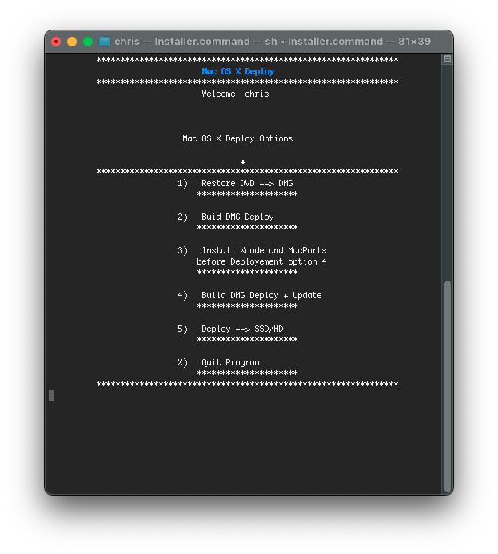

# Mac OS X Deploy
- Package Using ASR Restore to Deploy Mac OS X Snow Lopard 10.6.8 on SSD 
### Credit: [Apple](https://cdsassets.apple.com/live/6GJYWVAV/user/ma1170_welcome_to_snow_leopard.pdf)
### Inspired by [InstaDMG](https://code.google.com/archive/p/instadmg/)
### Download Release ➥ [Mac OS X Deploy](https://github.com/chris1111/Mac-OS-X-Deploy/releases/tag/Deploy)
### Usage ➥ [Usage PDF](https://github.com/chris1111/Mac-OS-X-Deploy/blob/main/Usage.pdf)

### Video Usage: Mac OS X Deploy ⬇︎

### Bonus: ☞ A working Browser after using Mac OS X Deploy utility [ArticFox](https://github.com/rmottola/Arctic-Fox/releases/download/v45.2/arcticfox-45.2.en-US.mac64.10.6.dmg)
- Move it to your Application then open it.
- My post about Artic Fox ➥ [Discussions ArticFox](https://github.com/rmottola/Arctic-Fox/discussions/240)
