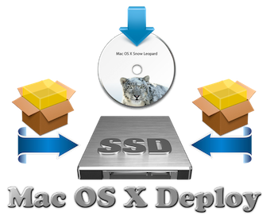
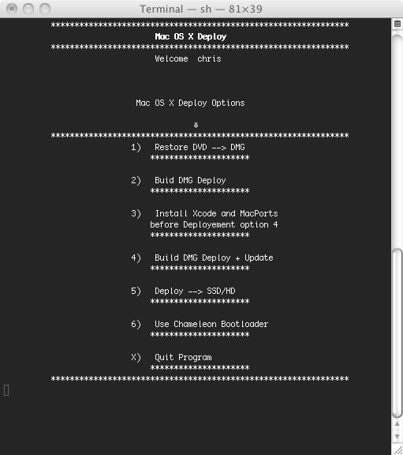

# Mac OS X Deploy

- Package Using ASR Restore to Deploy Mac OS X Snow Leopard 10.6.8 on SSD
-  To using this Package you must have Mac OS X Snow Leopard! Do not use on any system other than 10.6x
- To create Option (4) the Mac O S X Deploy 10.6x disk image
the program will need to install Xcode, MacPorts and curl on your current Mac because the original Apple Curl command no longer works.

### A story that dates back to [2017](https://www.hackintosh-montreal.com/t6467-mac-os-x-deploy) as far as I'm concerned.
### Credit: [Apple](https://cdsassets.apple.com/live/6GJYWVAV/user/ma1170_welcome_to_snow_leopard.pdf)
### Inspired by [InstaDMG](https://code.google.com/archive/p/instadmg/)
### Main Script ➥ [Mac OS X Deploy](https://github.com/chris1111/Mac-OS-X-Deploy/blob/main/Mac%20OS%20X%20Deploy/Scripts/Resources/MacOSXDeploy.sh)
### Download Release ➥ [Mac OS X Deploy](https://github.com/chris1111/Mac-OS-X-Deploy/releases/tag/Deploy)
### Usage ➥ [Usage PDF](https://github.com/chris1111/Mac-OS-X-Deploy/blob/main/Usage.pdf) 

### Video Usage: Mac OS X Deploy ⬇︎
- (NOTE Video change: Chameleon Bootloader Installation Package is now used instead of OpenCore.
- PHP56 is no longer used in the program.)

### Bonus: ☞ A working Browser after using Mac OS X Deploy utility [ArticFox](https://github.com/chris1111/Snow-Leopard-DVD-Creator/releases/download/USB-V1/ArticFox.pkg.zip)

