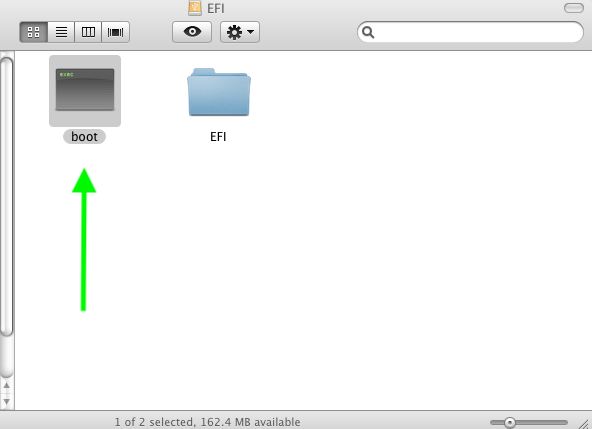

### If your System is UEFI, after option 5 (Deploy --> SSD/HD) Installing Legacy-OpenCore-Package.pkg 
#### remove the boot file in the EFI Partition 

Use the config.plist for UEFI attaching here. replace in EFI/OC
[config.plist.zip](https://github.com/chris1111/Mac-OS-X-Deploy/raw/refs/heads/main/UEFI/config.plist.zip)

-------------------------------------------------

[config.plist.zip](https://github.com/chris1111/Mac-OS-X-Deploy/blob/main/UEFI/config.plist)